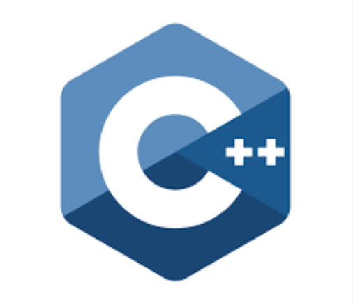
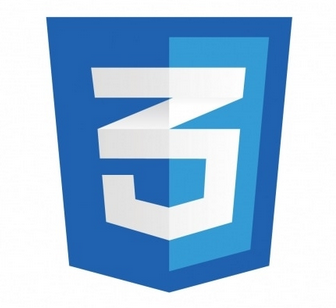

<h1 align="center">Hi 👋, I'm Pranav</h1>
<h3>A passionate web developer </h3>

- 🌱 I’m currently learning **Web development**

- 📫 How to reach me [**👉 📩 👈**](mailto:pranavshilavane1@gmail.com)

<h3 align="left">Languages and Tools:</h3>    

&nbsp;
   
&nbsp;
&nbsp;
&nbsp;&nbsp;

<h3 align="left">Connect with me:</h3>

&nbsp;&nbsp;&nbsp;&nbsp;&nbsp;&nbsp;&nbsp;
 
  

  

&nbsp;

 

